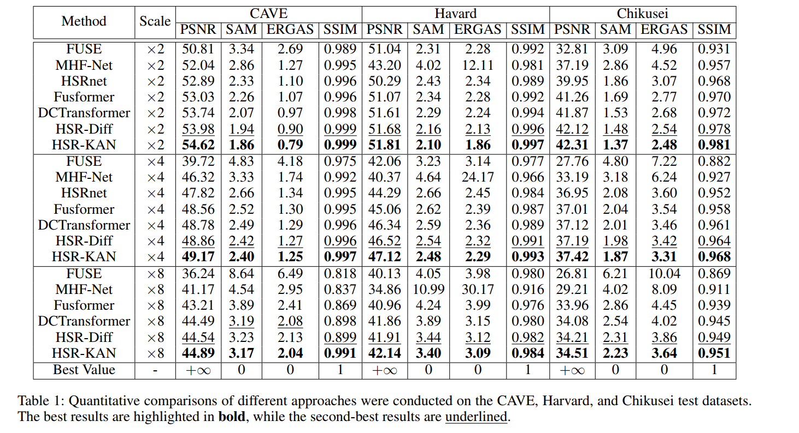
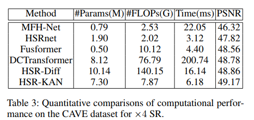
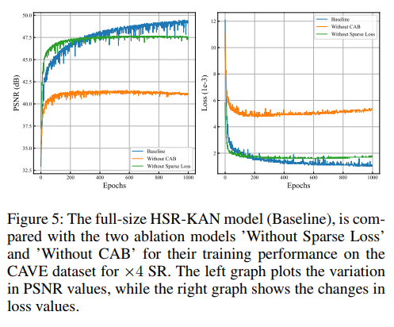

# HSR-KAN
The code of "HSR-KAN: Efficient Hyperspectral Image Super-Resolution via
Kolmogorov-Arnold Networks" [[arxiv]](https://arxiv.org/abs/2409.06705)

Hyperspectral images (HSIs) have great potential in various visual tasks due to their rich spectral information. However, obtaining high-resolution hyperspectral images remains challenging due to limitations of physical imaging. Inspired by _Kolmogorov-Arnold Networks_(KANs), we propose efficient HSI super-resolution (HSI-SR) model to fuse a low-resolution HSI (LR-HSI) and a high-resolution multispectral image (HR-MSI), yielding a high-resolution HSI (HR-HSI). To achieve the effective integration of spatial information from HR-MSI, we design a fusion module based on KANs, called KAN-Fusion. Further inspired by the channel attention mechanism, we design a spectral channel attention module called _KAN Channel Attention Block_ (KAN-CAB) for post-fusion feature extraction. As a channel attention module integrated with KANs, KAN-CAB not only enhances the fine-grained adjustment ability of deep networks, enabling networks to accurately simulate details of spectral sequences and spatial textures, but also effectively avoid _Curse of Dimensionality_ (COD). Extensive experiments show that, compared to current state-of-the-art (SOTA) HSI-SR methods, proposed HSR-KAN achieves the best performance in terms of both qualitative and quantitative assessments. 
## Requirements
- Python 3.8+
- PyTorch 1.4+
- CUDA 10.1+
- torchvision 0.5+
- h5py 2.10+
- matplotlib 3.2+

## Datasets
- CAVE: https://www.cs.columbia.edu/CAVE/databases/multispectral/
- Chikusei: https://naotoyokoya.com/Download.html 
- Havard: https://vision.seas.harvard.edu/hyperspec/download.html 

## Usage
```
python train.py --dataset CAVE --batch_size 32 --epochs 1000
```
We publish pre-trained network weights in the _models_ folder, which you can load and use directly!

## Experiments Results
### x2,x4,x8 SR on CAVE，Chikusei，Havard datasets

### Computational Efficiency

### Ablation experiments


## Acknowledgement
Our code references [efficient-kan](https://github.com/Blealtan/efficient-kan.git) and [pykan](https://github.com/KindXiaoming/pykan.git). Thanks for their greak work!
